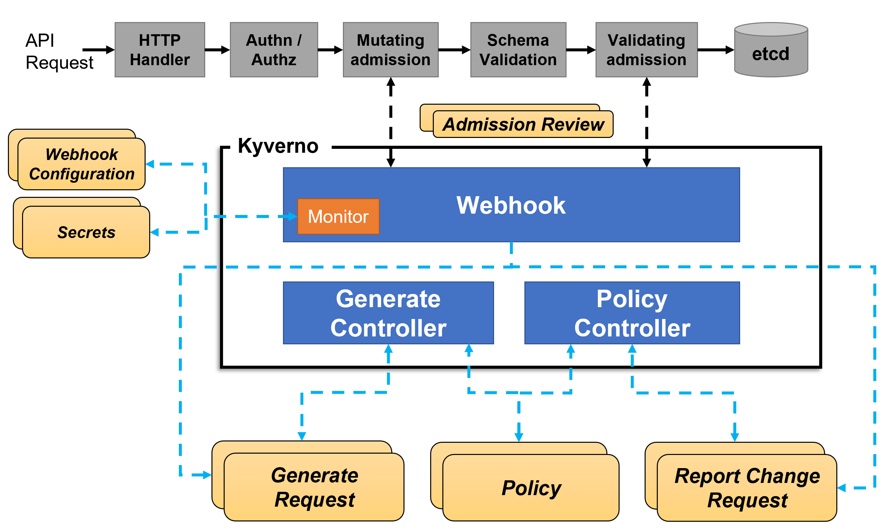
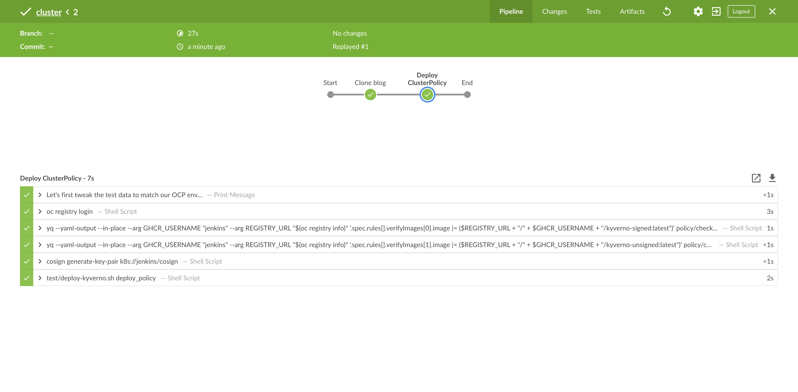
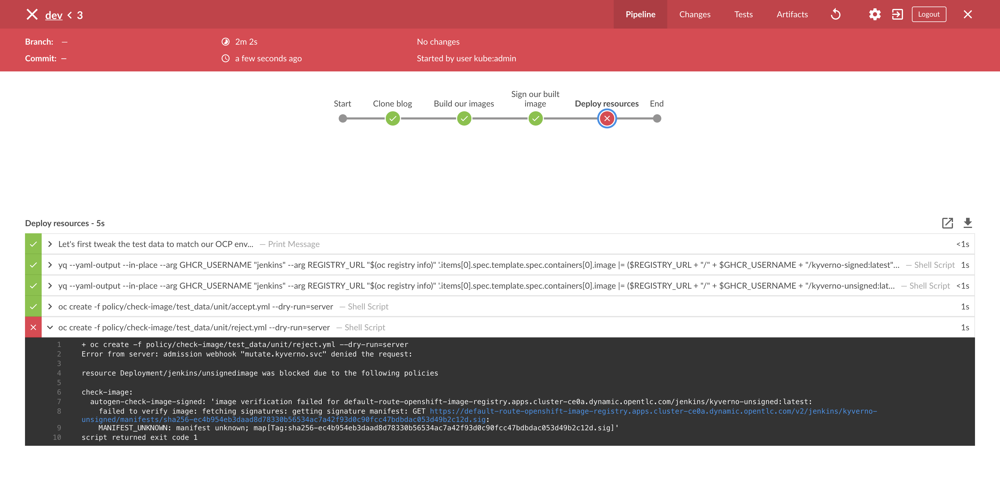

[]()

[](https://github.com/garethahealy/kyverno-verifyimages-blog/actions/workflows/tests.yaml)

# Software Supply Chain Security on OpenShift with Kyverno and Cosign
In a previous [blog post](https://cloud.redhat.com/blog/automate-your-security-practices-and-policies-on-openshift-with-kyverno),
I discussed the Kyverno policy engine and how it could be used to validate your Kubernetes resources by left-shifting your security and policy enforcement.

Another feature that Kyverno offers, which at the time of writing is alpha, is [image verification](https://kyverno.io/docs/writing-policies/verify-images/) that
uses the `cosign` component from the [sigstore](https://github.com/sigstore) project.

The aim of this blog post is not to explain what Kyverno or Cosign are but how they can be used together on OpenShift to
provide image verification. If you are new to Kyverno, I would suggest reading my previous [blog post](https://cloud.redhat.com/blog/automate-your-security-practices-and-policies-on-openshift-with-kyverno)
and if you are new to the sigstore project, give this [blog post](https://www.redhat.com/en/blog/sigstore-open-answer-software-supply-chain-trust-and-security) 
a read and this [press release](https://www.linuxfoundation.org/en/press-release/linux-foundation-announces-free-sigstore-signing-service-to-confirm-origin-and-authenticity-of-software/).

At the end of this blog post, you should have the knowledge and tools to:
- deploy Kyverno to a Kubernetes cluster.
- create `ClusterPolicy` that uses the `verifyImages` stanza that targets your image.
- build and sign a container image which is pushed to a `sigstore` [compatible registry](https://github.com/sigstore/cosign#registry-support).
- have the knowledge that you have improved your software supply chain security process by only allowing images that have been signed by your pipeline to run on your cluster.

Before we start to have a look at the policies to verify images, let's first remind ourselves what the architecture of Kyverno looks like:



## OK, Let's Take a Look at a Sample Policy

```yaml
1	apiVersion: kyverno.io/v1
2	kind: ClusterPolicy
3	metadata:
4	  name: check-image
5	  annotations:
6	    policies.kyverno.io/owner: Red Hat CoP
7	    policies.kyverno.io/category: Workload Management
8	    policies.kyverno.io/description: Check pod is using signed image
9	spec:
10	  validationFailureAction: enforce
11	  background: false
12	  rules:
13	    - name: check-image-signed
14	      match:
15	        resources:
16	          kinds:
17	            - Pod
18	      verifyImages:
19	        - image: ghcr.io/garethahealy/kyverno-signed:*
20	          key: |-
21	            -----BEGIN PUBLIC KEY-----
22	            MFkwEwYHKoZIzj0CAQYIKoZIzj0DAQcDQgAEe318Ki+bLHDsSOipamI4bhQnU6Jy
23	            6c+ys0jPFVuNYtNIq8N6rC6YJsfn3WXHb3AZHc0/nan3a9LN9pJG1mTYtw==
24	            -----END PUBLIC KEY-----
```

Hopefully, the above is easy to understand if you are comfortable with Kubernetes resources.
Let's go line by line and explain what each bit is doing:
- _line 1 to 2_: declares what type of resource it is, which in this example is cluster-wide
- _line 3 to 8_: is defining the metadata about the policy
- _line 10_: states what action should be taken when the policy is triggered, which in this case is denied
- _line 13 to 17_: is defining the resources, which this policy should match against
- _line 19_: is the image that policy matches, which has a wildcard for all tags
- _line 20 to 24_: is the public key generated by `cosign`

## Cool, How Do I Run That?
To run the above policy, it is expected the following tools are installed:
- [cosign](https://github.com/sigstore/cosign#installation), which is used to sign our container image.
- [bats-core](https://github.com/bats-core/bats-core#installation), which is a testing framework that will execute `oc`.
- [jq](https://stedolan.github.io/jq/download), which is used by the BATS framework to process JSON files.
- [yq](https://pypi.org/project/yq), which is used by the BATS framework to process YAML files.

You can execute the above policy by running the below commands.
_NOTE_: A user with cluster-admin permissions is required to deploy Kyverno.

```bash
git clone https://github.com/garethahealy/kyverno-verifyimages-blog.git
cd kyverno-verifyimages-blog

echo "Firstly, we'll need to fill in some properties which are used to push the image/keys to ghcr.io..."
echo "1. GHCR_TOKEN : PAT GitHub token to push our images to ghcr.io"
echo "2. GHCR_USERNAME : GitHub username"
echo "3. REGISTRY_URL : Registry to push images to, we'll default to: ghrc.io"
export GHCR_TOKEN=replace_me
export GHCR_USERNAME=replace_me
export REGISTRY_URL=ghrc.io

echo "OK, let's update the registry reference for the test data..."
yq --yaml-output --in-place --arg GHCR_USERNAME "${GHCR_USERNAME}" --arg REGISTRY_URL "${REGISTRY_URL}" '.items[0].spec.template.spec.containers[0].image |= ($REGISTRY_URL + "/" + $GHCR_USERNAME + "/kyverno-signed:latest")' policy/check-image/test_data/unit/accept.yml
yq --yaml-output --in-place --arg GHCR_USERNAME "${GHCR_USERNAME}" --arg REGISTRY_URL "${REGISTRY_URL}" '.items[0].spec.template.spec.containers[0].image |= ($REGISTRY_URL + "/" + $GHCR_USERNAME + "/kyverno-unsigned:latest")' policy/check-image/test_data/unit/reject.yml

echo "Let's have a look at the test data..."
cat policy/check-image/test_data/unit/accept.yml
cat policy/check-image/test_data/unit/reject.yml

echo "OK, let's update the registry reference for the policy..."
yq --yaml-output --in-place --arg GHCR_USERNAME "${GHCR_USERNAME}" --arg REGISTRY_URL "${REGISTRY_URL}" '.spec.rules[].verifyImages[0].image |= ($REGISTRY_URL + "/" + $GHCR_USERNAME + "/kyverno-signed:latest")' policy/check-image/src.yaml
yq --yaml-output --in-place --arg GHCR_USERNAME "${GHCR_USERNAME}" --arg REGISTRY_URL "${REGISTRY_URL}" '.spec.rules[].verifyImages[1].image |= ($REGISTRY_URL + "/" + $GHCR_USERNAME + "/kyverno-unsigned:latest")' policy/check-image/src.yaml

echo "Let's have a look at the policy..."
cat policy/check-image/src.yaml

echo "Let's have a look at the BATS tests..."
cat test/kyverno-integrationtests.sh

echo "Let's have a look at the script which is going to build and sign our image..."
cat test/build-and-sign.sh

echo "Now, let's build and sign our image..."
test/build-and-sign.sh

echo "Now, let's deploy kyverno (cluster-admin permissions required with a valid session)..."
test/deploy-kyverno.sh deploy_kyverno

echo "Now, let's deploy the kyverno policies..."
test/deploy-kyverno.sh deploy_policy

echo "Now, let's check the policy is active for our namespace but as a dry-run..."
bats test/kyverno-unittests.sh

echo "Finally, let's check the policy is active for our namespace..."
bats test/kyverno-integrationtests.sh
```

So what did the above do?
- You executed `test/build-and-sign.sh`, which used `podman` to build and push two images to `ghcr.io` and `cosign` to sign one of those images.
- You executed `test/deploy-kyverno.sh deploy_kyverno`, which deployed Kyverno onto your cluster in the `kyverno` namespace.
- You executed `test/deploy-kyverno.sh deploy_policy`, which applied a `ClusterPolicy` Kyverno CR to your cluster.
- You executed `test/kyverno-unittests.sh`, which used `BATS` to run `oc create --dry-run=server` which validated the policy worked as expected on-cluster.
- You executed `test/kyverno-integrationtests.sh`, which used `BATS` to run `oc create` which validated the policy worked as expected on-cluster, 
by deploying the signed image and being rejected to deploy the unsigned.

If you are unable to install the software required, you can [fork](https://github.com/garethahealy/kyverno-verifyimages-blog) my GitHub repository
which contains an [action](https://github.com/garethahealy/kyverno-verifyimages-blog/actions?query=is%3Asuccess) that runs the above
on commit. So why not have a tinker in your own little playground.

## OK, But How Do I Fit Image Verification Into My CI/CD Pipeline?
The following example presumes you are using a Jenkins deployed onto your cluster via:

```bash
oc new-project jenkins
oc process jenkins-persistent -p DISABLE_ADMINISTRATIVE_MONITORS=true -p MEMORY_LIMIT=2Gi -n openshift | oc create -n jenkins -f -
oc rollout status dc/jenkins --watch=true -n jenkins
```

If you are using another CI/CD tool, the key point is that we want to execute `cosign` and `oc` before deploying to the cluster.
To be able to execute the commands, you will need to replicate the same functionality from this [Dockerfile](https://github.com/garethahealy/kyverno-verifyimages-blog/blob/master/jenkins/Dockerfile).

Firstly, we need to build a Jenkins agent which can execute `cosign` and `oc` in our Jenkins project:

```bash
oc import-image quay.io/redhat-cop/jenkins-agent-python:v1.0 --confirm -n jenkins
oc create -f jenkins/CosignBuildConfig.yaml -n jenkins
oc start-build cosign-docker-build -n jenkins -w
```

Once the build is complete, let's allow the `jenkins` service account to create Kyverno policies:

```bash
oc adm policy add-cluster-role-to-user kyverno:admin-policies system:serviceaccount:jenkins:jenkins
```

Now, let's give Kyverno permissions to pull images from the internal registry:

```bash
oc create secret docker-registry regcred --docker-server=$(oc registry info) --docker-username=jenkins --docker-password=$(oc whoami --token) --docker-email=jenkins@ocp.com -n kyverno
oc patch Deployment/kyverno --type json -p='[{"op":"add","path":"/spec/template/spec/containers/0/args","value":["--imagePullSecrets=regcred"]}]' -n kyverno
oc rollout status Deployment/kyverno -n kyverno --watch=true
```

Next, let's open Jenkins and create two new pipeline jobs. The first is for our `cluster-admin` who
controls the policies:

```groovy
node ("jenkins-agent-cosign") {
    stage("Clone blog") {
        sh "git clone https://github.com/garethahealy/kyverno-verifyimages-blog.git"
    }

    stage("Deploy ClusterPolicy") {
        dir("kyverno-verifyimages-blog") {
            echo "Let's first tweak the test data to match our OCP env..."
            sh "oc registry login"
            sh """yq --yaml-output --in-place --arg GHCR_USERNAME "jenkins" --arg REGISTRY_URL "\$(oc registry info)" '.spec.rules[].verifyImages[0].image |= (\$REGISTRY_URL + "/" + \$GHCR_USERNAME + "/kyverno-signed:latest")' policy/check-image/src.yaml"""
            sh """yq --yaml-output --in-place --arg GHCR_USERNAME "jenkins" --arg REGISTRY_URL "\$(oc registry info)" '.spec.rules[].verifyImages[1].image |= (\$REGISTRY_URL + "/" + \$GHCR_USERNAME + "/kyverno-unsigned:latest")' policy/check-image/src.yaml"""

            sh "cosign generate-key-pair k8s://jenkins/cosign"
            
            sh "oc delete clusterpolicy --all"
            sh "test/deploy-kyverno.sh deploy_policy"
        }
    }
}
```

Which once triggered should give you similar output to:



The second is for our developers who will be creating resources that might trigger the policies:

```groovy
node ("jenkins-agent-cosign") {
    stage("Clone blog") {
        sh "git clone https://github.com/garethahealy/kyverno-verifyimages-blog.git"
    }

    stage("Build our images") {
        dir("kyverno-verifyimages-blog") {
            sh "oc import-image registry.access.redhat.com/ubi8/ubi-micro:8.4 --confirm"
            sh "oc apply -f jenkins/DevAppsBuildConfig.yaml"

            sh "oc start-build unsigned-docker-build -w"
            sh "oc start-build signed-docker-build -w"
        }
    }

    stage("Sign our built image") {
        dir("kyverno-verifyimages-blog") {
            sh "oc registry login"

            // NOTE: COSIGN_DOCKER_MEDIA_TYPES=1 is required for OCP < 4.7
            sh "cosign sign -key k8s://jenkins/cosign \$(oc registry info)/jenkins/kyverno-signed:latest"
        }
    }

    stage("Deploy resources") {
        dir("kyverno-verifyimages-blog") {
            echo "Let's first tweak the test data to match our OCP env..."
            sh """yq --yaml-output --in-place --arg GHCR_USERNAME "jenkins" --arg REGISTRY_URL "\$(oc registry info)" '.items[0].spec.template.spec.containers[0].image |= (\$REGISTRY_URL + "/" + \$GHCR_USERNAME + "/kyverno-signed:latest")' policy/check-image/test_data/unit/accept.yml"""
            sh """yq --yaml-output --in-place --arg GHCR_USERNAME "jenkins" --arg REGISTRY_URL "\$(oc registry info)" '.items[0].spec.template.spec.containers[0].image |= (\$REGISTRY_URL + "/" + \$GHCR_USERNAME + "/kyverno-unsigned:latest")' policy/check-image/test_data/unit/reject.yml"""

            sh "oc create -f policy/check-image/test_data/unit/accept.yml --dry-run=server"
            sh "oc create -f policy/check-image/test_data/unit/reject.yml --dry-run=server"
        }
    }
}
```

This should give you a similar output to the below, which shows our signed image being accepted but the unsigned image being rejected:



## But, I've got multiple clusters...
Most customers I speak with typically have multiple clusters that look similar to:
- sandbox
- development and test
- production _like_
- production

So how can they control the deployment of Kyverno policies across multiple clusters? I would suggest they make use of
[Red Hat Advanced Cluster Management for Kubernetes](https://www.redhat.com/en/technologies/management/advanced-cluster-management). 
Firstly, it helps with [cluster sprawl](https://www.redhat.com/en/resources/wiley-publishing-managing-kubernetes-clusters-checklist)
which can become a problem with the above environment setup. Secondly, it offers the ability to [replicate Kyverno policies](https://cloud.redhat.com/blog/generating-governance-policies-using-kustomize-and-gitops)
and report back to the _Hub_ cluster when a policy is in violation which greatly improves the DevEx.

## What next?
Hopefully, you've seen how easy it is to verify images on your cluster. As the feature is still alpha, it needs
users to start trying it out in anger and finding issues so that it can be promoted to GA.

The Kyverno community on [slack](https://slack.k8s.io/#kyverno) are friendly and most importantly, super active.
So if you hit any issues or have any suggestions, head over and get involved.

Other use cases for `cosign` are also being adopted by open-source projects, such as [Tekton Chains](https://github.com/tektoncd/chains)
which shows that `sigstore` and software supply chain security are hot topics currently.